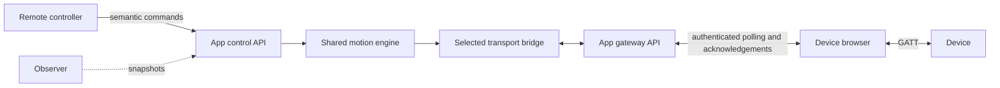

# Authenticated browser Bluetooth gateway

Implementation checkpoint: 2026-09-13 on `codex/lan-wan-control`. This addresses
parts of LAN-01, LAN-03, LAN-05 and LAN-15 in the
[full LAN/WAN checklist](lan-wan-control-checklist.md). Real browser/device,
network fault, load and physical Stop acceptance remain open.

## Two distinct responsibilities

The browser holding the Bluetooth connection is the device gateway. Another
authorized browser may control the shared motion engine remotely. Taking
control changes the controller; it does not transfer the Bluetooth connection.

There is still one motion engine and one selected transport path. The HTTP
boundary owns account/session checks; transport code has no account or HTTP
imports. The browser executes backend commands and retains its existing local
Emergency Stop fallback.

An in-process regression reproduced the earlier gap: a signed-in observer could
copy the gateway's public client ID and retrieve its queued work. The corrected
handler denies that request and leaves the work available to the owning device
browser. The test uses a fake bridge and synthetic accounts.

## Identity and admission

A protected gateway connection binds:

- the authenticated login session;
- the document's ordinary client ID header;
- the separate browser Bluetooth client ID;
- the server process epoch and a new gateway connection generation.

IDs and generations remain identifiers, not login credentials. Same-login tabs
share an account/session security boundary. A different account or login
session cannot gain gateway access by copying the public identifiers.

The selected gateway epoch/generation is returned to its owning session/tab.
Protected status reports, command polls, acknowledgements and owner disconnects
send `X-MagicHandy-Gateway-Epoch` and
`X-MagicHandy-Gateway-Generation`. They are independent of controller generation
and command-delivery tickets. Gateway bookkeeping does not consume controller
command sequence numbers.

Each protected connection also gets a distinct internal transport identity.
An old poll cannot drain a replacement connection's queue even if cancellation
arrives between its initial authorization and the bridge read. Public snapshots
map the identity back to the ordinary browser ID while it is bound and omit it
after release. Session keys and login tokens are never included.

| Operation | Authority and behavior |
| --- | --- |
| Connect | Requires host administrator permission and current controller admission. An existing or stopping gateway must be disconnected/released first. |
| Observe status | Authenticated shared status; it does not claim a gateway or renew its lease. |
| Poll, status report, ACK | Requires the owning session/tab, matching Bluetooth client ID, current gateway epoch/generation and a live lease. |
| Disconnect from the device browser | Requires its current gateway binding and remains available after it becomes a controller observer. |
| Disconnect from another browser | Requires a controlling administrator and the ordinary protected command-delivery checks. |

Explicit Bluetooth Disconnect retains the existing global Stop coordinator.
Gateway maintenance requests stay attached to their login and gateway lifetime,
so a controller handoff does not cancel the channel needed to deliver Stop.
Trusted unprotected loopback clients retain their existing ID-based API.
Remote hosting modes require account protection.

## Loss and replacement

The protected gateway lease lasts ten seconds and the access watchdog checks
it every second. Valid incoming maintenance requests renew it. Server-side
waiting or outgoing telemetry does not renew this separate lease. Expired
metadata is rejected at admission and cannot revive the connection.

Logout/session expiry, reported disconnection and lease loss retire the
connection and cancel its pending polls. If browser Bluetooth is the selected
transport, gateway loss synchronously invalidates shared control work and
schedules the existing engine Stop in a tracked worker. A replacement remains
blocked until teardown finishes. Ending an unused gateway does not stop another
selected transport. Enabling account protection also retires a formerly
unprotected, unbound gateway.

The browser registers only after the core confirms its gateway binding. It
does not send background status reports for another browser's device. The
panel identifies **This browser** or **Another browser**, and opening the native
device chooser requires host configuration permission.

A failed gateway command/ACK channel or a hidden device document ends the local
connection. The browser attempts its direct Stop, allows at most one second
for that attempt before GATT teardown, and requires explicit reconnection. A
slow full-state poll alone does not interrupt a healthy gateway channel.
Ordinary Emergency Stop cancels obsolete work while retaining the gateway for
subsequent backend Stop delivery. Native writes check their cancellation
generation after waiting for the writer, so an invalidated command cannot start
writing when that queue resumes.

These are host/browser policies, not a physical stopping-time guarantee.
Disconnected links, OS/browser scheduling, native writes already in flight and
device-buffered motion still need measured acceptance. Simulator evidence does
not establish Android/iOS, GATT disconnect or real WAN behavior.

## Login idle time

Controller and gateway liveness are separate from login activity. Automatic
chat cursors, Bluetooth status/ACK/disconnect reports, voice playback
acknowledgements, video duration reports and periodic media synchronization
inspect the login without extending its idle timestamp. GET/HEAD polling
remains passive. Logout also avoids an unnecessary idle renewal before ending
the session.

Media synchronization can carry explicit user actions as well as heartbeats.
After bounded decoding and event validation, play, pause, seeking, seeked,
rate change and resync intentions record login activity. Malformed events,
heartbeat, natural end and close notifications do not. An expired login cannot
be revived by these requests. The existing thirty-minute idle and absolute
expiry policies remain in force; automatic playback alone does not keep a
protected login alive indefinitely.

## Evidence

The [gateway regressions](../internal/httpapi/bluetooth_gateway_test.go) cover
copied IDs across accounts, logins and distinct declared tabs; pending polling
through controller handoff; old connection/process metadata; and expiry,
revocation and disconnection stopping the shared fake engine. A transport
regression verifies that a canceled poll cannot consume queued work.

The [browser tests](../web/src/components/BluetoothBridge.test.tsx) cover gateway
metadata, observer/host permissions, local Stop, queued write cancellation,
channel failure, background/return and unmount cleanup. API tests verify
gateway headers, separation from controller delivery and aborted response
rejection. [Idle tests](../internal/httpapi/session_idle_test.go) inspect the
persisted login timestamp around automatic and explicit requests.

Final gates, artifact measurements and the current-source review are recorded
in the [implementation log](lan-wan-implementation.md) and
[goal scorecard](goal-scorecard.md). This checkpoint does not close the full
route/permission matrix, certificate deployment, stronger login recovery,
session/audit UI or network/device acceptance items.
