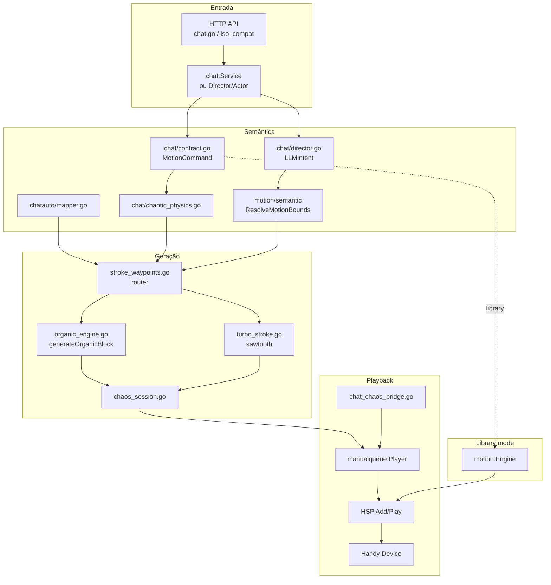
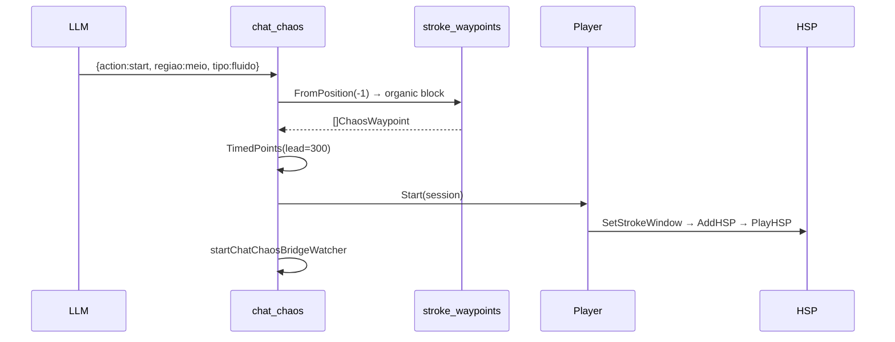
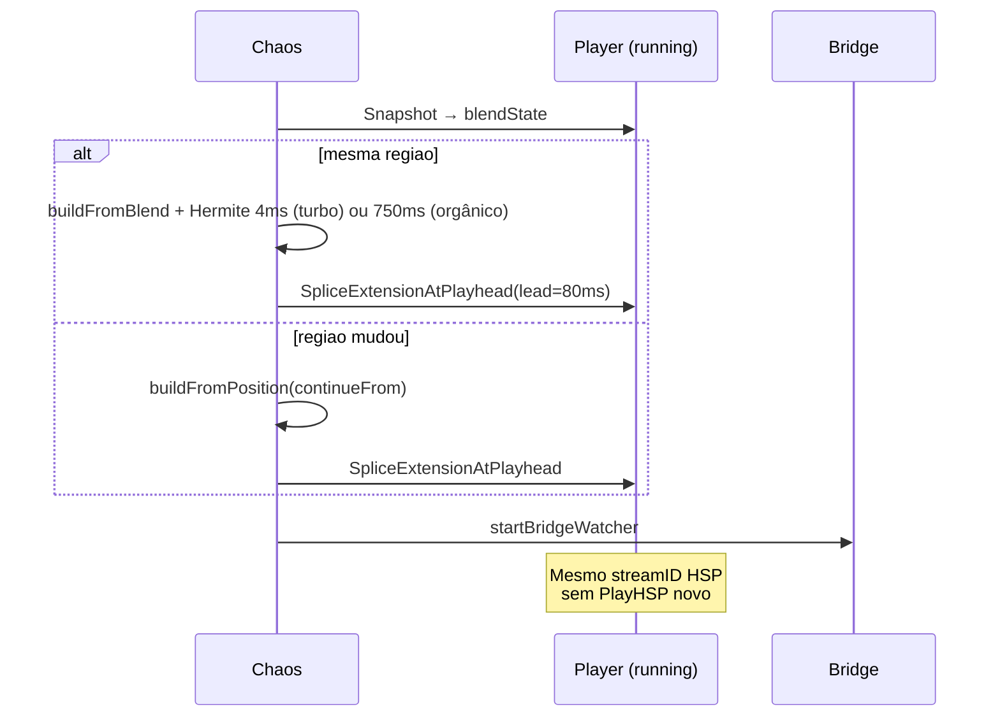
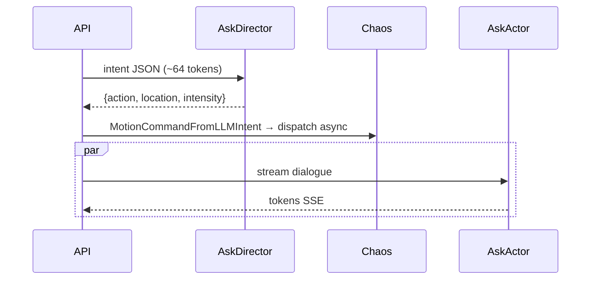

# Movimento Procedural no Modo Chat — Análise Macro e Micro

> **Escopo:** MagicHandy (`c:\dev\git\MyProjects\Handy\MagicHandy`)  
> **Última revisão:** 2026-07-13 (reanálise completa do código atual)  
> **Objetivo:** Documentar com precisão técnica como o motor procedural funciona hoje — da entrada HTTP/LLM até o comando HSP no device.

---

## Sumário

1. [Estado atual (resumo executivo)](#1-estado-atual-resumo-executivo)
2. [Glossário e taxonomia](#2-glossário-e-taxonomia)
3. [Arquitetura macro](#3-arquitetura-macro)
4. [Entry points e roteamento](#4-entry-points-e-roteamento)
5. [Fluxo — Chat híbrido (LLM JSON)](#5-fluxo--chat-híbrido-llm-json)
6. [Fluxo — Director/Actor (feature 002)](#6-fluxo--directoractor-feature-002)
7. [Fluxo — Chat Auto](#7-fluxo--chat-auto)
8. [Pipeline de geração (código atual)](#8-pipeline-de-geração-código-atual)
9. [Motor orgânico + StrokeProfile](#9-motor-orgânico--strokeprofile)
10. [Motor turbo (vibrate / very_fast / turbo)](#10-motor-turbo-vibrate--very_fast--turbo)
11. [Semantic zoning e bounds](#11-semantic-zoning-e-bounds)
12. [Conversão waypoints → sessão HSP](#12-conversão-waypoints--sessão-hsp)
13. [Playback `manualqueue.Player`](#13-playback-manualqueueplayer)
14. [Bridge filler (continuidade)](#14-bridge-filler-continuidade)
15. [Crossfade e blend](#15-crossfade-e-blend)
16. [Física caótica e contrato LLM](#16-física-caótica-e-contrato-llm)
17. [Settings e eixos físicos](#17-settings-e-eixos-físicos)
18. [Estruturas de dados](#18-estruturas-de-dados)
19. [Mapa de arquivos](#19-mapa-de-arquivos)
20. [Constantes de timing](#20-constantes-de-timing)
21. [Testes e validação em device](#21-testes-e-validação-em-device)
22. [Problemas conhecidos e gaps](#22-problemas-conhecidos-e-gaps)
23. [Diagramas de sequência](#23-diagramas-de-sequência)
24. [Apêndice: legado](#24-apêndice-legado)

---

## 1. Estado atual (resumo executivo)

O motor procedural **ativo** gera timelines de pontos (`[]ChaosWaypoint` → `[]TimedPoint`) e envia ao Handy via **HSP** através do `manualqueue.Player`. O `motion.Engine` (library/semantic retarget) é um **stack paralelo**, usado apenas quando `motion_generation_mode != "procedural"`.

### Camadas de entrada

| Camada | Trigger | Intenção | Player | Continuidade |
|--------|---------|----------|--------|--------------|
| **Chat híbrido** | `POST /api/chat/send` ou `/stream` | LLM → `MotionCommand` JSON | `chatChaos.player` | Append / splice |
| **Director/Actor** | `director_mode=true` + procedural | LLM Director → `LLMIntent` → `MotionCommand` | `chatChaos.player` | Idem |
| **Chat Auto** | `operation_mode: auto` | Roteiro → `Intent` → `MapIntent` | `chatAuto.player` (`Continuous=true`) | Append + bridge |
| **Freestyle procedural** | modo freestyle + procedural | `ProceduralFreestyleSegment` | `freestyleChaos.player` | Segmentos |
| **Manual queue** | UI library | Blocos importados | `manualQueue.player` | **Não** usa gerador procedural |

### Pipeline único de geração

```
ChaoticPhysics
  → stroke_waypoints.go (router)
      ├─ IsTurboTipo? → turbo_stroke.go (sawtooth 1ms, compactado p/ transport)
      └─ senão → organic_engine.go (Perlin + StrokeProfile assimétrico)
  → chaos_waypoints_hsp.go (timestamps + lead)
  → chaos_session.go → manualqueue.Session
  → Player (Start | SpliceExtensionAtPlayhead | AppendExtension)
  → transport HSP (SetStrokeWindow → AddHSP → PlayHSP)
```

### O que mudou desde a versão anterior deste doc

| Antes (doc antigo) | Agora (código) |
|--------------------|----------------|
| `buildContinuousZoneStroke` + `buildVibrateStroke` em `stroke_waypoints.go` | **Removido** — orgânico em `organic_engine.go`, turbo em `turbo_stroke.go` |
| Chat chaos reiniciava player em cada `target` | **Append** com `SpliceExtensionAtPlayhead` (mesma zona) ou `FromPosition` (mudança de zona) |
| Sem bridge no chat híbrido | **`chat_chaos_bridge.go`** — watcher goroutine, filler 8s |
| Sem Director/Actor | **`chat_director.go`** + `semantic/` quando `director_mode=true` |
| Golpes simétricos (sin) | **`generateOrganicBlock`** com `StrokeProfile` assimétrico + bounce deepthroat |
| Turbo = mesmo path orgânico | **Path dedicado** sawtooth + `compactTurboWaypointsForTransport` |

---

## 2. Glossário e taxonomia

### 2.1 `motion_generation_mode`

```go
MotionGenerationModeProcedural = "procedural"  // ChaoticPhysics → HSP
MotionGenerationModeLibrary    = "library"     // motion.Engine + patterns
```

Roteamento em `dispatchChatMotionForResult`:

```go
if s.shouldUseChaoticChatMotion(command, settings) {
    return s.dispatchChatChaoticMotionAsync(ctx, command, settings)
}
return s.dispatchChatMotion(ctx, command)  // engine path
```

### 2.2 `operation_mode`

| Valor | Comportamento |
|-------|---------------|
| `hybrid` (default) | Uma resposta LLM por mensagem; motion no fim do turno |
| `auto` | Sessão autônoma com stamina, roteiro, prefetch, bridge |

### 2.3 `director_mode` (LLM)

Quando `settings.LLM.DirectorMode == true` **e** procedural:

- **Director** (`AskDirector`): JSON rápido `{action, location, intensity}` — sem diálogo
- **Actor** (`AskActor`): streaming de texto com contexto físico
- Motion dispara **antes** do Actor (latência zero no movimento)

### 2.4 Eixo semântico Handy (0–100)

| `regiao` | Range (Min–Max) | Zone semantic (Director) |
|----------|-----------------|--------------------------|
| `base` | 0–29 | `base` |
| `meio` | 30–69 | `shaft` |
| `cabeca` | 70–100 | `tip` |
| `meio_cabeca` | 30–100 | — |
| `meio_base` | 0–69 | — |
| `full`, `completo`, `cabeca_base` | 0–100 | `full` |

Duas fontes de bounds: **hardcoded** (`chaosRegionRange`) e **prefs** (`MotionPreferences` zones 0..1) no Director.

### 2.5 `tipo_batida`

Perfis de timing e algoritmo de geração. Tipos válidos: `simples`, `leve`, `moderado`, `alto`, `fluido`, `lento`, `very_fast`, `vibrate`, `turbo`.

**Turbo path** (`very_fast`, `vibrate`, `turbo`): sawtooth 1ms lógico, empacotado 8–12ms para cloud REST.

---

## 3. Arquitetura macro



### Exclusão mútua ao iniciar motion

`playChatChaoticMotion` e `startChatAutoPreparedSegment` param, nesta ordem:

1. `motion.Engine`
2. `manualQueue.player`
3. (re)usa ou cria `chatChaos.player` / `chatAuto.player`

`NotifyChatStop()` desliga o keepalive do `modes.Manager` (path library).

---

## 4. Entry points e roteamento

| Entrada | Arquivo | Função | Condição |
|---------|---------|--------|----------|
| Chat SSE/send | `chat.go`, `lso_compat.go` | `handleChatStream`, `handleChatSend` | `operation_mode` |
| Director | `chat_director.go` | `handleChatStreamDirector` | `DirectorMode && procedural` |
| Chat chaos | `chat_chaos.go` | `playChatChaoticMotion` | `MotionGenerationModeProcedural` |
| Chat auto | `chat_auto.go` | `startChatAutoPreparedSegment` | `operation_mode: auto` |
| Freestyle | `freestyle_chaos.go` | `startFreestyleChaosSegment` | freestyle + procedural |
| Manual queue | `queue_player.go` | `startManualQueuePlayback` | library blocks only |

```
handleChatStream
  ├─ DirectorMode? → handleChatStreamDirector → dispatchChatChaoticMotionAsync
  └─ senão → chat.Service.Complete → dispatchChatMotionForResult
                ├─ procedural → dispatchChatChaoticMotionAsync
                └─ library    → dispatchChatMotion → motion.Engine
```

---

## 5. Fluxo — Chat híbrido (LLM JSON)

### 5.1 Sequência

1. Usuário envia mensagem → LLM retorna `{reply, motion}`
2. `ParseAssistantResponseForMode` → `MotionCommand` (ou scene director fallback)
3. `NormalizeChaoticPhysics`
4. `dispatchChatChaoticMotionAsync` — throttle 450ms, `generation++`, goroutine
5. `playChatChaoticMotion` → gera sessão → player

### 5.2 Encadeamento mid-session (não reinicia HSP)

Se `chatChaos.player` já está `Running`:

| Cenário | Builder | Playback |
|---------|---------|----------|
| Mesma `regiao` | `buildChaosSessionForDurationFromBlend` | `SpliceExtensionAtPlayhead` (lead 80ms) |
| `regiao` mudou | `buildChaosSessionForDurationFromPosition(continueFrom)` | splice ou append |
| Falha splice/append | — | `Stop` + `Start` novo player |
| Sem player | `FromPosition(-1)` | `Start` (lead 300ms) |

**Importante:** o player **mantém o mesmo `streamID` HSP** em append/splice — não há `PlayHSP` novo a cada `target` (exceto restart).

### 5.3 Duração por `tipo_batida`

| `tipo_batida` | Duração (ms) |
|---------------|--------------|
| `very_fast`, `vibrate`, `turbo` | 2 500 |
| `alto` | 4 000 |
| `moderado` | 5 000 |
| `leve`, `simples` | 6 000 |
| `fluido`, `lento` (default) | 7 000 |

---

## 6. Fluxo — Director/Actor (feature 002)

### 6.1 Director (`internal/chat/director.go`)

- Schema JSON: `action` ∈ {oral, handjob, riding, titjob, deepthroat}, `location` ∈ {base, shaft, tip, full}, `intensity` 1–10
- `MotionCommandFromLLMIntent`:
  - `velocidade = 22 + intensity*8`
  - `tipo_batida`: handjob→simples, titjob→leve, riding/oral→fluido
  - `StrokeRange` via `semantic.ResolveMotionBounds`
  - `regiao` via `LocationToRegiao`

### 6.2 Actor (`internal/chat/actor.go`)

Streaming de diálogo **depois** do dispatch de motion, com contexto `{action, location, intensity}` no prompt.

### 6.3 StrokeProfile (implementado, wiring parcial)

`BuildChaoticPhysicsFromIntent` monta `ChaoticPhysics` com `Action` + `StrokeProfile`:

| Action | Downstroke | Upstroke | Bounce |
|--------|------------|----------|--------|
| `riding` | 35% | 65% | não |
| `deepthroat` | 30% | 70% | sim (engasgo) |

**Gap:** `playChatChaoticMotion` monta `ChaoticPhysics` **sem** `Action`/`StrokeProfile` — o bounce do deepthroat **não chega ao device** no fluxo HTTP atual. Ver §22.

---

## 7. Fluxo — Chat Auto

Mesmo gerador (`buildChaosSessionForDurationFromPosition/FromBlend`), mas:

- `session.Continuous = true` — player nunca auto-finaliza
- Duração driven por **stamina** (`chatauto/stamina.go`) + roteiro LLM
- `playbackQueue` com prefetch (target depth 2)
- Bridge próprio: `chatAutoLoopBridgeSeconds = 30s`, lead 10s
- `chatAutoMaybeLoopBridge` quando `remaining < 10s` e fila vazia

Chat auto **cede** ao chat chaos: loop bloqueia enquanto `chatChaosActive()`.

---

## 8. Pipeline de geração (código atual)

```
ChaoticPhysics {
    Velocidade, Intensidade, Regiao, TipoBatida, AtrasoMS
    StrokeRangeMin/Max float64  // opcional, Director
    Action string               // opcional, não wired no dispatch
    StrokeProfile               // opcional, não wired no dispatch
}
        │
        ▼
stroke_waypoints.go
  generateOrganicFromPhysics / generateOrganicStreamFromPhysics
        │
        ├─ IsTurboTipo(tipo)? ──────────────────────┐
        │                                            ▼
        │                              turbo_stroke.go
        │                              GenerateTurboWaypointsForDuration
        │                              compactTurboWaypointsForTransport
        │
        └─ senão ───────────────────────────────────┐
                                                   ▼
                                    organic_engine.go
                                    OrganicConfigFromPhysics
                                    generateOrganicWaypoints / Stream
                                    → generateOrganicBlock
        │
        ▼
chaos_waypoints_hsp.go: ChaosWaypointsToTimedPoints(waypoints, leadMS)
        │
        ▼
chaos_session.go: chaosSessionFromWaypoints → manualqueue.Session
```

### Funções públicas principais

| Função | Uso |
|--------|-----|
| `GenerateStrokeWaypointsFromPosition` | Chat híbrido (segmento único) |
| `GenerateProceduralStreamFromPosition` | Chat auto (stream longo) |
| `GenerateProceduralStreamFromBlend` | Append com Hermite crossfade |
| `buildChaosSessionForDurationFromBlend` | `chaos_session.go` — chat chaos append |
| `buildChaosSessionForDurationFromPosition` | Start ou mudança de zona |

---

## 9. Motor orgânico + StrokeProfile

### 9.1 `OrganicConfig` (`organic_engine.go`)

Mapeia `ChaoticPhysics` → parâmetros Perlin:

- `StrokeMin/Max` — bounds 0–100 (região ou `StrokeRange`)
- `NoiseWeight`, `Asymmetry`, `Intensity`, `BaseVelocity`
- `SampleIntervalMS` — via `ResolveAtrasoMS`
- `StrokeProfile` — via `resolveStrokeProfile(physics)`

### 9.2 `generateOrganicBlock` (substitui loop sin simétrico)

Ciclo de stroke com duração `estimateStrokeCycleMS` (~900ms + ajuste por velocidade):

1. **Downstroke** (`cycleProgress < DownstrokeRatio`): `signal = 1 - easeInQuad(local)` → topo→fundo
2. **Upstroke**: `signal = easeOutCubic(local)` → fundo→topo
3. Perlin modula assimetria em ascent/descent (`nAscent`, `nDescent`, `nDrift`, `nMicro`)
4. `signal` clamped `organicMinSignal..organicMaxSignal` (0.03–0.97)
5. `pos = StrokeMin + signal * span`
6. `clampOrganicStep` + `enforceMinOrganicStep` (mín 3 unidades entre pontos)

### 9.3 Bottom bounce (`stroke_profile.go`)

Quando `HasBottomBounce` e motor atinge o fundo:

```
a) Atinge BotPos
b) Sobe para BotPos + 15% span (+ Perlin wobble) em ~75ms
c) Volta ao BotPos em ~75ms
d) Inicia upstroke mais lento
```

Posições clamped 0..1 normalizado → 0..100 no device.

### 9.4 Zone bridge na entrada

Se `continueFrom` está fora da zona alvo: `organicZoneBridge` com Hermite (`CubicHermiteCrossfade`).

---

## 10. Motor turbo (vibrate / very_fast / turbo)

Arquivo: `internal/motion/turbo_stroke.go`

### 10.1 Algoritmo

- **Sawtooth** com delta lógico **1ms** (`turboPointDeltaMS` — sem jitter quando `atraso <= 1`)
- `step` proporcional à velocidade e span da zona
- Oscila entre `low` e `high`:
  - `turbo` / `very_fast`: região **completa** (min..max da zona)
  - `vibrate`: sub-range (`vibrateBounds` — ~25–75% do span)

### 10.2 Compactação para transport

`compactTurboWaypointsForTransport` — merge em janelas de 8–12ms:

- Se min≠max na janela: emite **dois** pontos (min→max) preservando zigzag
- Reduz volume de `hsp/add` na cloud REST (evita timeout)

| Tipo | Pack MS |
|------|---------|
| `vibrate`, `turbo` | 8 |
| `very_fast` | 12 |

### 10.3 `HardwareSafetyLock`

Se `true`: `clampDelta` força **mínimo 30ms** — **destrói** feel turbo/vibrate. Testes de device usam `HardwareSafetyLock=false`.

---

## 11. Semantic zoning e bounds

Pacote: `internal/motion/semantic/`

| Arquivo | Responsabilidade |
|---------|------------------|
| `intent.go` | `LLMIntent`, `ActionName`, `LocationName` |
| `preferences.go` | `MotionPreferences` — zones `base/shaft/tip/full` em 0..1 |
| `resolver.go` | `ResolveMotionBounds(intent, prefs)` |
| `stroke_profile.go` | `ResolveStrokeProfile(intent)` |
| `legacy.go` | `BoundsFromRegiao`, `LocationToRegiao` |
| `organic_adapter.go` | `OrganicConfigFromIntent` (testes) |

Action overrides em prefs (ex.: `deepthroat → full` zone).

---

## 12. Conversão waypoints → sessão HSP

### 12.1 `ChaosWaypoint`

```go
type ChaosWaypoint struct {
    TimeDelta int  // ms desde waypoint anterior
    Position  int  // 0..100 absoluto no eixo
}
```

### 12.2 Lead times

| Contexto | Lead | `session.Continuous` |
|----------|------|----------------------|
| Start novo | 300ms | false |
| Chain / continue | 80ms | false |
| Blend append | 0ms | **true** |

### 12.3 `manualqueue.Session`

```go
type Session struct {
    Points        []TimedPoint
    DurationMS    int
    Continuous    bool
    StrokeMin     int  // settings StrokeMinPercent
    StrokeMax     int  // settings StrokeMaxPercent
}
```

`StrokeMin/Max` → `SetStrokeWindow` no device (eixo físico global do usuário), **independente** da `regiao` do comando.

---

## 13. Playback `manualqueue.Player`

Arquivo: `internal/manualqueue/player.go`

| Constante | Valor | Função |
|-----------|-------|--------|
| `playerLeadMS` | 650 | buffer ahead antes de dispatch |
| `playerDispatchTick` | 90ms | tick do loop |
| `playerChunkSize` | 40 | pontos por `AddHSP` |
| `playerFinishTailMS` | 500 | tail antes de finish |

### Loop

1. `SetStrokeWindow(StrokeMin, StrokeMax)`
2. A cada tick: dispatch pontos onde `pointMS <= localElapsed + 650`
3. `hspAbsoluteBatch(baseMS, batch)` — timeline monotônica
4. Primeiro batch → `PlayHSP`; demais → `AddHSP` only
5. `compactTimelineLocked` quando >180 pontos já dispatchados
6. `Continuous=true` → nunca auto-finish

### `SpliceExtensionAtPlayhead` (novo)

Usado em retarget **mesma zona**:

1. Corta pontos com `TimeMillis > playhead + leadMS`
2. Reancora extension no splice point
3. Evita enfileirar novo segmento **no fim** do bridge filler (bug antigo de zona presa)

Fallback: `AppendExtension` → restart player.

---

## 14. Bridge filler (continuidade)

Arquivo: `internal/httpapi/chat_chaos_bridge.go`

### Chat chaos bridge

| Constante | Valor |
|-----------|-------|
| `chatChaosLoopBridgeLeadMS` | 15 000 (dispara quando restam ≤15s) |
| `chatChaosLoopBridgeSeconds` | 8s de filler |
| `chatChaosBridgePollInterval` | 100ms |
| `chatChaosLoopBridgeDebounce` | 400ms |
| `chatChaosBridgeEmergencyMS` | 800ms (ignora debounce) |

Fluxo:

1. `startChatChaosBridgeWatcher` após cada dispatch bem-sucedido
2. `chatChaosMaybeLoopBridge` → `buildChatChaosLoopBridge` → `player.AppendExtension`
3. Filler clona `lastPhysics`; não-turbo suaviza para `fluido`; turbo preserva tipo e `atraso=1`
4. `resetChatChaosBridgeDebounce` em cada novo dispatch

**Objetivo:** zero paradas do Handy entre segmentos LLM (`max_idle_gap → 0` nos testes de device).

---

## 15. Crossfade e blend

Arquivo: `internal/motion/organic_blend.go`

| Componente | Descrição |
|------------|-----------|
| `MotionBlendState` | posição + velocidade (%/s) do player |
| `CubicHermiteCrossfade` | 500–1000ms, 3–5 pontos (orgânico) |
| `StitchWithCrossfade` | prepend Hermite antes do stream |
| `CrossfadeOptionsForPhysics` | turbo: **4ms / 2pts**; orgânico: **750ms / 4pts** |

`estimateBlendStateFromPlayer`: posição atual + lookback 80ms para velocidade.

**Código morto:** `applyCrossfadeIfNeeded` (no-op), `appendBridgedWaypoints` (sem callers) em `stroke_waypoints.go`.

---

## 16. Física caótica e contrato LLM

### 16.1 `MotionCommand`

```go
type MotionCommand struct {
    Action      string    // start|target|stop
    Velocidade  int       // 1–100
    Intensidade int       // 1–100
    Regiao      string
    TipoBatida  string
    AtrasoMS    int
    StrokeRange []float64 // opcional [min,max] 0..1, Director
}
```

### 16.2 `ResolveAtrasoMS`

| `tipo_batida` | Base (ms) |
|---------------|-----------|
| `very_fast`, `vibrate`, `turbo` | 1 |
| `alto` | 40 |
| `moderado` | 80 |
| `leve`, `simples` | 120 |
| `lento`, `fluido` | 160 |

Escalado por `scaleAtrasoByVelocity` quando `atraso > 1`.

### 16.3 Dois contratos LLM coexistem

1. **Scene director** (`scene_director.go`): `ride/tease/pause/stop` + `stroke_range` — chat híbrido sem DirectorMode
2. **Director enum** (`director.go`): `oral/handjob/riding/...` + `location` — quando `director_mode=true`

Mapeamentos de `tipo_batida` diferem entre os dois.

---

## 17. Settings e eixos físicos

| Setting | Efeito procedural |
|---------|-------------------|
| `motion_generation_mode` | `"procedural"` → chat chaos |
| `hardware_safety_lock` | min 30ms entre pontos — quebra turbo |
| `stroke_min/max_percent` | `SetStrokeWindow` no Handy |
| `motion_preferences` | zones 0..1 para Director |
| `llm.director_mode` | split Director/Actor |

**Duas camadas de posição:**

1. **Waypoints** — posição absoluta 0–100 dentro da `regiao`/`StrokeRange`
2. **Stroke window** — limites físicos do device (`StrokeMinPercent..StrokeMaxPercent`)

Se stroke window estiver estreito (ex. 0–28%), o device **nunca** alcança zonas altas mesmo com waypoints em 70–100.

---

## 18. Estruturas de dados

### Runtime chat chaos

```go
type chatChaosRuntime struct {
    mu               sync.Mutex
    player           *manualqueue.Player
    generation       uint64
    lastDispatchTime time.Time
    lastPhysics      motion.ChaoticPhysics
    hasLastPhysics   bool
    lastBridgeAt     time.Time
    dispatchInFlight bool
    bridgeCancel     context.CancelFunc
}
```

### Pipeline tipado

```
MotionCommand → ChaoticPhysics → []ChaosWaypoint → []TimedPoint
    → manualqueue.Session → manualqueue.Player → HSP
```

---

## 19. Mapa de arquivos

| Arquivo | Responsabilidade |
|---------|------------------|
| `httpapi/chat_chaos.go` | Dispatch procedural, splice/append, generation cancel |
| `httpapi/chat_chaos_bridge.go` | Bridge filler watcher |
| `httpapi/chat_director.go` | Director/Actor SSE handler |
| `httpapi/chaos_session.go` | Waypoints → Session, blend state |
| `httpapi/chat_auto.go` | Loop autônomo, queue, bridge auto |
| `httpapi/freestyle_chaos.go` | Freestyle procedural segments |
| `chat/director.go` | AskDirector, MotionCommandFromLLMIntent |
| `chat/actor.go` | AskActor streaming |
| `chat/chaotic_physics.go` | NormalizeChaoticPhysics |
| `chat/scene_director.go` | Fallback ride/tease (sem DirectorMode) |
| `motion/stroke_waypoints.go` | **Router** orgânico vs turbo |
| `motion/organic_engine.go` | Perlin + generateOrganicBlock |
| `motion/organic_motion.go` | jitteredTimeDelta, easing helpers |
| `motion/organic_blend.go` | Hermite crossfade |
| `motion/turbo_stroke.go` | Sawtooth + compactação transport |
| `motion/stroke_profile.go` | StrokeProfile + bottom bounce |
| `motion/chaotic_physics.go` | DTO ChaoticPhysics |
| `motion/chaos_waypoints.go` | RegionBounds apenas (+ legado test) |
| `motion/chaos_waypoints_hsp.go` | TimedPoint conversion |
| `motion/semantic/*` | Zoning prefs, resolver, stroke profile |
| `manualqueue/player.go` | HSP streaming, splice, append |
| `manualqueue/timeline.go` | Interpolação UI |

---

## 20. Constantes de timing

### Chat chaos

| Constante | Valor |
|-----------|-------|
| `chatChaosDispatchMinInterval` | 450ms |
| `chaosLeadMillis` | 300ms |
| `chaosChainLeadMillis` | 80ms |
| `chatChaosLoopBridgeLeadMS` | 15s |
| `chatChaosLoopBridgeSeconds` | 8s |
| `chatChaosBridgePollInterval` | 100ms |
| `chatChaosLoopBridgeDebounce` | 400ms |

### Player

| Constante | Valor |
|-----------|-------|
| `playerLeadMS` | 650ms |
| `playerDispatchTick` | 90ms |
| `playerChunkSize` | 40 |
| Compact threshold | 180 pontos |

### Chat auto (distinto)

| Constante | Valor |
|-----------|-------|
| `chatAutoLoopBridgeSeconds` | 30s |
| `chatAutoLoopBridgeLeadMS` | 10s |

---

## 21. Testes e validação em device

### Integration (`//go:build integration`)

```powershell
$env:MAGICHANDY_DATA_DIR = "c:\dev\git\MyProjects\Handy\MagicHandy\.local-data"
```

| Teste | O que valida |
|-------|--------------|
| `TestProceduralSyncUninterruptedOnRealDevice` | Chain append, zero restart HSP |
| `TestChatContinuousSyncOnRealDevice5Min` | Matriz 9×7 tipos×zonas, 5min, `active_ratio≥0.8` |
| `TestTurboFastVelocitiesOnRealDevice` | very_fast/vibrate/turbo only, `max_idle=0` |
| `TestMotionCalibrateBatteryDevice` | Calibração por tipo em device real |

### Unit (fake transport)

| Arquivo | Foco |
|---------|------|
| `chat_chaos_bridge_test.go` | Bridge append sem restart |
| `chaos_session_test.go` | Duração, turbo cabeça positions |
| `turbo_stroke_test.go` | Sawtooth, compaction |
| `stroke_profile_test.go` | Riding asymmetry, deepthroat bounce |
| `organic_engine_test.go` | Perlin continuity |
| `semantic/resolver_test.go` | Bounds matrix |
| `manualqueue/player_append_test.go` | Append timeline |

### Métricas de continuidade (device)

- `active_ratio` — fração do tempo com player rodando
- `max_idle_gap` — maior pausa entre amostras (ideal: 0)
- `min_hsp_delta` — menor intervalo entre pontos HSP (turbo: ≤20ms packed)
- `position_range` — amplitude física observada

---

## 22. Problemas conhecidos e gaps

### P0 — Críticos

| ID | Problema | Impacto |
|----|----------|---------|
| P0-A | **StrokeProfile não wired no dispatch** — `playChatChaoticMotion` ignora `Action`/`StrokeProfile`; deepthroat bounce e riding asymmetry não aplicam | Feel Director incorreto |
| P0-B | **Dois stacks motion** (Engine vs HSP Player) | Recovery, testes, telemetria fragmentados |
| P0-C | **Keepalive incompatível** com procedural — `NotifyChatStop()` mata recovery engine | Sessão morre em transport drop |

### P1 — Importantes

| ID | Problema | Impacto |
|----|----------|---------|
| P1-A | **Stroke window global** vs zona do comando — `StrokeMaxPercent` estreito limita travel físico | Zonas altas inacessíveis |
| P1-B | **Cloud REST timeout** com turbo denso — mitigado por compactação 8ms, ainda ocorre sob carga | `player=false`, gaps |
| P1-C | **Dois contratos LLM** (scene vs director) com mapeamentos diferentes | Confusão de semântica |
| P1-D | **Throttle 450ms silencioso** — dispatches rápidos ignorados | Motion não aplica |
| P1-E | **`HardwareSafetyLock=true`** anula turbo 1ms | Feel errado em produção |

### P2 — Melhorias

| ID | Problema |
|----|----------|
| P2-A | Docs `05-procedural-bridge-filler.md` desatualizada (10s/30s vs 15s/8s código) |
| P2-B | `appendBridgedWaypoints`, `applyCrossfadeIfNeeded` — código morto |
| P2-C | `GenerateChaoticWaypoints` legado só em testes (`chaos_waypoints_test.go`) |
| P2-D | Chat auto vs chaos — dois bridges com constantes diferentes |
| P2-E | Linear interpolation no device entre keyframes packed turbo |

### Resolvidos recentemente (2026-07-13)

- ✅ Turbo/vibrate path dedicado (não mais Perlin)
- ✅ Bridge filler no chat chaos
- ✅ `SpliceExtensionAtPlayhead` para retarget sem fila no fim do timeline
- ✅ `max_idle=0` e `active_ratio≥0.96` em testes de device (matriz contínua)
- ✅ StrokeProfile + `generateOrganicBlock` implementados (falta wiring)

---

## 23. Diagramas de sequência

### 23.1 Primeiro `start` (hybrid procedural)



### 23.2 `target` mid-session (append, não restart)



### 23.3 Director mode



---

## 24. Apêndice: legado

### `GenerateChaoticWaypoints` (`chaos_waypoints_test.go` only)

Gerador pré-orgânico com algoritmos por tipo (`simples`→2 pontos, `alto`→blocos micro). **Não chamado em produção.**

### `buildContinuousZoneStroke` / `buildVibrateStroke` (removidos)

Estavam em `stroke_waypoints.go` (commit `295a9e7`). Substituídos por:

- **Orgânico:** `generateOrganicBlock` + Perlin
- **Turbo:** `GenerateTurboWaypointsForDuration` + sawtooth

### Scene director (`ride/tease`)

Ainda ativo como fallback no chat híbrido quando LLM não usa DirectorMode. Schema diferente do Director enum.

---

## Referências cruzadas

- [ADR-0015 Semantic Zoning](./adrs/0015-semantic-zoning-director-actor.md)
- [Domain rule 05 — Bridge filler](./domain_rules/05-procedural-bridge-filler.md) *(constantes desatualizadas — ver §20)*
- [HSP v4 invariants](./hsp-v4-invariants.md)
- [Motion transport contract (ADR 0002)](./adrs/0002-motion-transport-contract.md)
- [Feature 002 TRACKER](./tasks/features/002-semantic-zoning-director-actor/TRACKER.md)

---

*Documento atualizado por análise estática de `MagicHandy/internal/` — julho/2026. Reflete código em `main` pós feature 002 fases 0–3 + correções turbo/bridge.*
