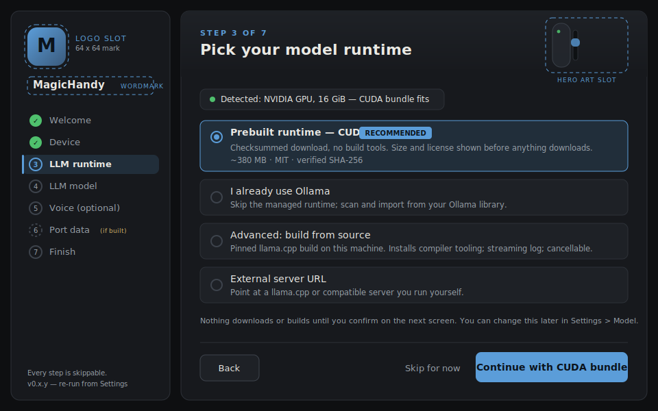

# Setup Wizard — Experience Design

[gui-installer.md](gui-installer.md) decides the architecture (thin Inno shell,
the app is the installer, `#/setup` orchestrates existing APIs). This document
designs the **experience**: the complete user decision tree, the screen anatomy
and visual treatment, and the branding slots that get filled once final assets
exist. It is the reference for slice 16.2 implementation and for whoever
produces the logo/wordmark.

Wireframe: [setup-wizard-sketch.svg](setup-wizard-sketch.svg) — drawn in the
real design tokens; dashed azure boxes mark branding slots.



## Design goals

1. **Simple**: one question per screen, a recommended default pre-selected on
   every screen, and a visible "Skip for now" everywhere. A user who presses
   the primary button through the whole wizard gets a working, sensible app.
2. **Complete**: every real choice is reachable — nothing requires editing
   files or reading source. The advanced paths (source build, external server,
   custom assets) are present but visually secondary.
3. **Honest**: sizes, licenses, and checksums are shown *before* any download;
   the wizard never claims more than the backend verified (the same consent
   law as `install.ps1`).
4. **Never a trap**: the wizard is skippable end to end, re-runnable from
   Settings, and every step is the normal settings/API surface — abandoning it
   half-way leaves a fully usable app.

## The decision tree

The complete set of decisions a user can face, in order, with defaults. The
wizard renders one node per screen; "default" is what the primary button does
if the user changes nothing. Steps 0 and 8 are not choices, just framing.

```text
0. Artifact (before the app runs — README/release page, not the wizard)
   ├─ Setup binary (.exe)      → default for end users; shortcuts + uninstall
   ├─ Portable zip             → no-install/USB use; same app, no shell
   └─ Source (install.ps1)     → developers/unattended; console, not GUI

1. Welcome / consent            [no decision — states the rules]

2. Device — "How does your device connect?"
   ├─ Handy via cloud (connection key)     → DEFAULT; write-only key + check
   ├─ Handy via browser Bluetooth          → needs Chrome/Edge; localhost only
   ├─ Intiface Central (other hardware)    → server address; select actuator
   └─ Skip — decide later                  → app runs; connect from top bar

3. LLM runtime — "Where does the model run?"          [hardware probe shown]
   ├─ Prebuilt managed runtime             → DEFAULT
   │   ├─ CUDA bundle    → recommended when the probe finds an NVIDIA GPU
   │   └─ CPU bundle     → recommended otherwise; always available fallback
   ├─ I already use Ollama                 → skip managed runtime entirely
   ├─ Advanced: source build (CPU/CUDA)    → existing build endpoint; dev path
   ├─ External server URL                  → self-managed llama.cpp/compatible
   └─ Skip — decide later                  → chat disabled until configured

4. LLM model — "Pick a model."                        [only if 3 ≠ skip]
   ├─ Curated download                     → DEFAULT once 16.x lands;
   │                                          VRAM-fit badge per entry
   ├─ Import a GGUF file                   → existing import
   ├─ Import from Ollama library           → shown when 3 = Ollama or a
   │                                          library is detected
   └─ Skip — decide later

5. Voice — "Voice is optional." (two independent toggles, both OFF)
   ├─ Speech input (ASR)
   │   ├─ Managed Parakeet download        → size/license/SHA-256 shown
   │   └─ Custom/external path             → advanced disclosure
   ├─ Spoken replies (TTS)
   │   ├─ NeuTTS (local cloning)           → prebuilt runner + verified assets;
   │   │                                      needs reference WAV + transcript
   │   └─ ElevenLabs (cloud)               → write-only API key
   └─ Skip — decide later                  → DEFAULT (both toggles off)

6. Port from StrokeGPT-ReVibed              [conditional — exists only if the
   ├─ Detect / browse → dry-run report       undecided Phase 15 importer is
   │   → per-category opt-in → import        built; otherwise absent]
   └─ Skip

7. Finish                       [no decision — summary of chosen/skipped,
                                 data-dir path, local URL, where to change
                                 everything later]
```

Rules the tree encodes:

- **The spine is 2→3→4**: device, runtime, model. Everything else is optional
  decoration. A user in a hurry answers three questions.
- **The hardware probe** (GPU presence + VRAM, via the runtime's existing
  detection) runs before step 3 renders and only *re-orders recommendations*;
  it never hides an option or auto-downloads anything.
- Step 4 adapts to step 3 (Ollama import surfaces when relevant) but never
  dead-ends: every step has Skip.
- Voice defaults **off** and stays off even after assets install — installing
  and enabling remain separate acts (ADR 0007).
- No step commands the device; the step-2 connection check is the existing
  non-motion check.

## Screen anatomy

Two-region layout (see the wireframe):

- **Left rail** (fixed, `--surface`): brand block (logo + wordmark slots),
  then the step list. Completed steps get a green check disc, the current step
  an accent-tinted row with a 3 px accent bar (same treatment as the nav
  rail's active route), pending steps hollow numbered discs. Conditional step
  6 renders dashed while undecided. Footer: version + "re-run from Settings".
- **Main pane** (`--surface` panel): a **hero band** (state below), an
  eyebrow (`STEP N OF 7`), one plain-language question as the title, the
  probe/context chip when relevant, then **choice cards** — radio semantics,
  one pre-selected, `RECOMMENDED` tag on the default, one-line explanation and
  a size/license/checksum line on anything that downloads. A consent reminder
  sits above the footer. Footer: `Back` (secondary), `Skip for now` (ghost,
  right-aligned next to primary), and a primary button that **names the
  consequence** ("Continue with CUDA bundle", never bare "Next").

Progress-heavy steps (downloads, source builds) reuse the existing Model-UI
progress components: byte progress, streaming log disclosure, and a working
Cancel. The wizard adds no new progress machinery.

## Eye candy — within the design system

The wizard should feel like the most polished screen in the app without
breaking [ui-design-guidelines.md](ui-design-guidelines.md) (one interactive
hue, no glow/purple, radius caps, reduced-motion honored):

- **Hero band**: a `--surface-2 → --surface` vertical gradient strip at the
  top of the main pane — depth from the surface ladder, not shadows — housing
  the step title and the art slot.
- **Step art**: small line-art vignettes per step, drawn in the same stroke
  style as the connection artwork and motion visualizer (the device capsule
  silhouette, signal arcs, a model "chip", a waveform for voice). Decorative
  only (`aria-hidden`), muted graphite strokes with at most one accent element
  each. The wireframe's hero shows the device-capsule motif.
- **Completion moment**: the Finish step reuses the connection artwork's
  concentric-arc motif in `--ok` green over a summary card — a quiet "ready"
  beat, no confetti, no animation loops. (The console installer already has
  completion art; this is its GUI counterpart.)
- **Motion**: step transitions are a 120–160 ms fade/6 px slide, disabled
  entirely under `prefers-reduced-motion`. Nothing bounces, pulses, or glows.
- **Focus**: the standard 2 px `--focus` outline; the step list is a proper
  `nav` with `aria-current="step"`.

## Branding slots

Everything below ships with the placeholder noted until final art exists;
each slot is dashed-azure in the wireframe. Formats chosen to match what the
consumer (app, Inno, GitHub) actually requires.

| Slot | Consumed by | Spec | Placeholder today |
| --- | --- | --- | --- |
| **Logo mark** | wizard rail, nav avatar, About | SVG, square, legible at 24 px | steel-gradient "M" tile (`--accent`→`--steel-deep`) |
| **Wordmark** | wizard rail, README hero | SVG, horizontal, dark-bg | plain "MagicHandy" in UI font |
| **App icon** | exe, shortcuts, taskbar | `.ico` (16/24/32/48/256) | Go default (none) — needed by slice 16.1 |
| **Favicon** | browser tab | 32 px PNG + SVG | Vite default |
| **Hero art** | wizard hero band | inline SVG per step, ≤ ~2 KB each | device-capsule vignette (in wireframe) |
| **Installer banner** | Inno `WizardImageFile` | 164×314 BMP (and @2x 328×628) | solid `--bg` with centered logo slot |
| **Installer small image** | Inno `WizardSmallImageFile` | 55×58 BMP (and @2x 110×116) | logo mark on `--bg` |
| **Finish/ready art** | wizard Finish, installer finish page | SVG, `--ok` accent | green concentric arcs (connection-artwork motif) |
| **Social/release card** | GitHub release notes, README | 1280×640 PNG | none — optional, last |

Rules: raster assets are generated from the SVG sources at build/release time
and are **not** hand-maintained committed duplicates; the connection-manager
hand PNG (~437 KiB) stays the embedded-payload ceiling — wizard art must stay
vector and small (scorecard watch-list item 4); and the placeholder "M" tile
remains the fallback wherever a final asset is missing, so branding can land
incrementally without blocking 16.2.

## Copy tone

Plain language, second person, no jargon on the happy path ("Where does the
model run?", not "Select inference runtime provider"). Technical detail lives
in the card's second line or a disclosure. Every download states size and
license in the card. Warnings use the standard status colors and never
exclamation marks.

## Acceptance checklist (slice 16.2 exit)

- Primary-button-only run yields: device checked (or skipped), CPU/CUDA
  prebuilt runtime + curated model installed, voice off, app usable.
- Every step reachable, skippable, and re-runnable from Settings; abandoning
  mid-wizard leaves a working app.
- Keyboard-only completion; `aria-current` step list; reduced-motion clean.
- All downloads show size/license/SHA-256 before starting and report byte
  progress with working Cancel.
- Branding slots render placeholders when final assets are absent.
- 390 px and 1280 px rendered checks (the rail collapses to a top stepper
  under 700 px).

## Cross-references

- [gui-installer.md](gui-installer.md) — architecture, wizard step contract,
  gaps table (this doc designs its steps 1–7).
- [installation-automation.md](installation-automation.md) — parity plan the
  wizard completes (step 7 of its roadmap).
- [ui-design-guidelines.md](ui-design-guidelines.md) — the visual law this
  design stays inside.
- [IMPLEMENTATION_PLAN.md](../IMPLEMENTATION_PLAN.md) Phase 16 — slices 16.0
  (bundles), 16.1 (Inno shell, consumes the icon/banner slots), 16.2 (this
  wizard), 16.3 (conditional port step).
